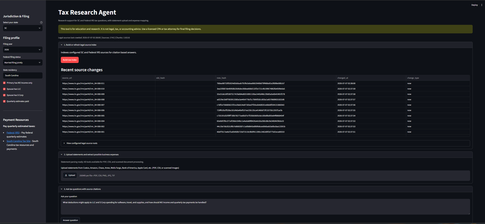
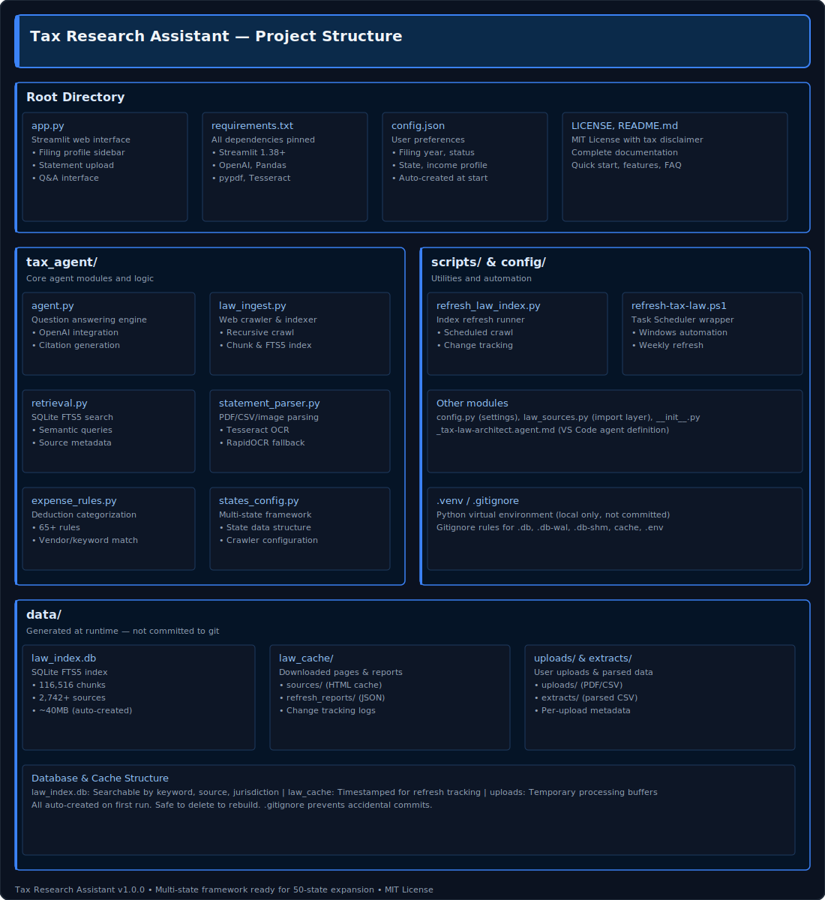

# Tax Research Assistant

**Local tax research, statement parsing, and expense categorization for W2 + business household scenarios.** Q&A with IRS/state law citations. Works offline, no cloud dependencies.

116,516 indexed legal chunks from 2,742+ IRS and state tax sources. Built with Streamlit, SQLite FTS5, and Tesseract OCR.

Available on [The Agent Skills Directory](https://skills.sh/johnB007/Tax-Research-Assistant)

---

## Features

- Upload and parse bank statements (PDF, CSV, scanned images)
- Auto categorize business expenses with 65+ IRS rules
- Ask tax questions. Get answers with legal source citations
- Filing profile aware (year, status, W2/LLC/S-Corp/quarterly estimates)
- Multi-state framework (SC + Federal; add NY, TX, CA, etc. by configuration)
- Fully offline. No cloud uploads, no telemetry
- Optional OpenAI integration for structured answer synthesis

---

## Disclaimer

**Research and education only.** Not legal, tax, or accounting advice. Tax law changes yearly. Always confirm with a licensed CPA or attorney before filing. Statements contain mixed transactions. Final categorization requires professional review.

---

## Screenshots



---

## Project structure



---

## Quick Start

### 1. Install

```powershell
python -m venv .venv
.\.venv\Scripts\Activate.ps1
pip install -r requirements.txt
```

### 2. (Optional) Add OpenAI key

Copy `.env.example` to `.env` and paste your API key. LLM mode is optional; the app works fully in retrieval only mode.

```powershell
Copy-Item .env.example .env
# Edit .env with your OPENAI_API_KEY
```

### 3. Start the app

```powershell
streamlit run app.py
```

App opens at `http://localhost:8501`

### 4. Build the legal index

On first run, click **Build law index** button. Takes 3-8 minutes (one time).

---

## System requirements

- **OS**: Windows 10, 11, or Server 2019+
- **Python**: 3.10+
- **Disk**: 500MB free (index, caches, uploads)
- **Internet**: One-time download for legal sources (then fully offline)
- **Optional**: Tesseract 5.5.0 for scanned statement OCR

---

## Usage

1. **Upload statements**: PDF, CSV, or scanned images (Chase, Amex, Wells Fargo, PayPal, etc.)
2. **Review extracts**: Download CSV with categorized transactions
3. **Ask questions**: Q&A interface with IRS/state law citations
4. **Configure profile**: Set filing year, status, business setup for tailored answers

---

## Troubleshooting

**Module not found?** Activate venv: `.\.venv\Scripts\Activate.ps1` then reinstall: `pip install -r requirements.txt`

**OpenAI error on startup?** Remove `.env` file to run in retrieval only mode (no key required).

**Indexing hangs?** Check internet, verify firewall allows `dor.sc.gov`, `scstatehouse.gov`, `irs.gov`. Restart and retry.

**PDF shows "text=unavailable"?** If scanned, Tesseract will handle it (if installed). Otherwise try re-exporting the PDF.

**No search results?** Verify index was built. Try simpler keywords: "LLC deductions" vs "limited liability company business expense treatment".

---

## Workflow recommendation

1. **Setup** (15 min): Install deps, build index, optionally install Tesseract
2. **Quarterly**: Upload statements, review categorized expenses, note edge cases for your CPA
3. **Before filing**: Reconcile with CPA, confirm treatments, verify estimated payments
4. **Year-round**: Ask tax questions as situations arise, save important citations

---

## Extending to other states

Add state config to `tax_agent/states_config.py`, then rebuild index:

```python
NY_CRAWL_ROOTS = (
    CrawlRoot(
        name="New York Individual Income Tax",
        jurisdiction="NY",
        seed_url="https://www.tax.ny.gov/",
        allowed_prefixes=("https://www.tax.ny.gov",),
        max_pages=5000,
        max_depth=10,
    ),
)

STATES_AVAILABLE["NY"] = {
    "name": "New York",
    "crawl_roots": NY_CRAWL_ROOTS,
    "description": "NY Individual Income Tax and Federal IRS guidance",
}
```

State automatically appears in app dropdown. Rebuild index: `python scripts/refresh_law_index.py`

---

## Performance

- App startup: 2-3 seconds
- PDF upload (text): 2-5 seconds
- CSV upload: 1 second
- Scanned image (OCR): 10-30 seconds
- SQLite search: 0.5-2 seconds
- LLM answer (OpenAI): 10-20 seconds
- Full index build: 3-8 minutes
- Index size: ~40-50MB (2,742 sources, 116,516 chunks)

---

**v1.0.0** (2026-07-07) — Initial release with SC + Federal law sources

---

- [README](README.md)
- [Contributing](CONTRIBUTING.md)
- [MIT license](LICENSE)
- [Security](SECURITY.md)
